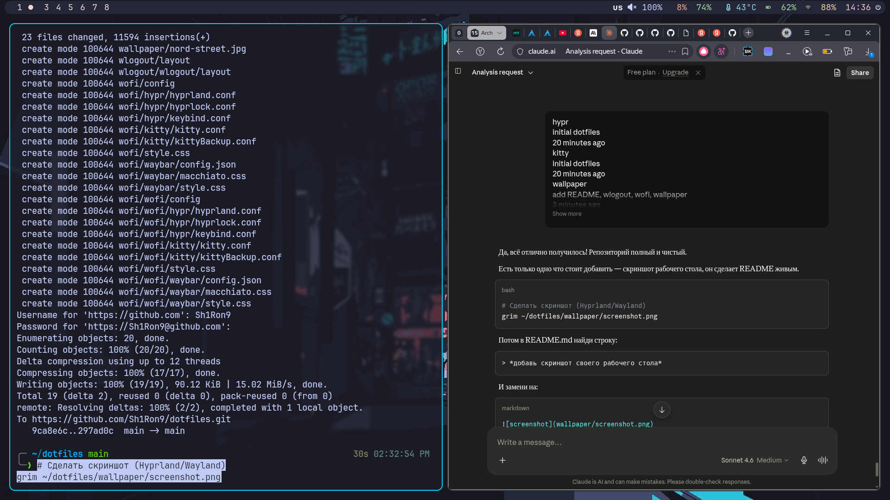

[README.md](https://github.com/user-attachments/files/28911550/README.md)
# dotfiles — Sh1Ron


Мои конфиги для Arch Linux + Hyprland.

## Скриншот

> 

---

## Система

| | |
|---|---|
| **OS** | Arch Linux |
| **WM** | Hyprland (Wayland) |
| **Терминал** | Kitty |
| **Shell** | Zsh + Oh My Zsh + Powerlevel10k |
| **Бар** | Waybar |
| **Меню** | Wofi |
| **Тема** | Catppuccin Macchiato |
| **Шрифт** | JetBrains Mono |
| **Монитор** | eDP-1, 1920x1080 @ 144Hz |

---

## Установка

### Шаг 1 — Зависимости

```bash
sudo pacman -S hyprland waybar wofi kitty zsh git \
  bluez bluez-utils blueman \
  pipewire pipewire-pulse wireplumber \
  brightnessctl pavucontrol \
  thunar grim slurp wl-clipboard \
  ttf-jetbrains-mono otf-font-awesome ttf-font-awesome \
  noto-fonts noto-fonts-emoji \
  flatpak wlogout
```

```bash
# AUR (через yay)
git clone https://aur.archlinux.org/yay.git
cd yay && makepkg -si
yay -S awww
```

### Шаг 2 — Клонировать репозиторий

```bash
git clone https://github.com/Sh1Ron9/dotfiles.git ~/dotfiles
```

### Шаг 3 — Скопировать конфиги

```bash
cd ~/dotfiles

cp -r hypr ~/.config/hypr
cp -r waybar ~/.config/waybar
cp -r kitty ~/.config/kitty
cp -r wofi ~/.config/wofi
cp -r wlogout ~/.config/wlogout
cp .zshrc ~/.zshrc
cp .p10k.zsh ~/.p10k.zsh

# Обои
mkdir -p ~/Pictures/wallpaper
cp wallpaper/nord-street.jpg ~/Pictures/wallpaper/
```

### Шаг 4 — Zsh

```bash
# Oh My Zsh
sh -c "$(curl -fsSL https://raw.githubusercontent.com/ohmyzsh/ohmyzsh/master/tools/install.sh)"

# Powerlevel10k
git clone --depth=1 https://github.com/romkatv/powerlevel10k.git \
  "${ZSH_CUSTOM:-$HOME/.oh-my-zsh/custom}/themes/powerlevel10k"

# Плагины
git clone https://github.com/zsh-users/zsh-autosuggestions \
  ${ZSH_CUSTOM:-~/.oh-my-zsh/custom}/plugins/zsh-autosuggestions

git clone https://github.com/zsh-users/zsh-syntax-highlighting.git \
  ${ZSH_CUSTOM:-~/.oh-my-zsh/custom}/plugins/zsh-syntax-highlighting

# Сменить shell
chsh -s /bin/zsh
reboot
```

### Шаг 5 — Bluetooth

```bash
sudo systemctl enable --now bluetooth
# GUI
blueman-manager
```

### Шаг 6 — VPN (v2rayA)

```bash
yay -S v2raya
sudo systemctl enable --now v2raya
# Интерфейс: http://127.0.0.1:2017
# Важно: выбрать System Proxy (не просто PROXY)
```

---

## Горячие клавиши (основные)

> `Super` = `Alt` (настроено через `$mainMod = Mod1`)

| Комбинация | Действие |
|---|---|
| `Super + Enter` | Терминал (kitty) |
| `Super + D` | Меню (wofi) |
| `Super + F` | Полноэкранный режим |
| `Super + Q` | Закрыть окно |
| `Super + 1-8` | Переключить workspace |
| `Alt + Shift` | Сменить раскладку |
| `F1 / F2` | Яркость − / + |

---

## Структура репозитория

```
dotfiles/
├── hypr/
│   ├── hyprland.conf
│   ├── keybind.conf
│   └── hyprlock.conf
├── waybar/
│   ├── config.json
│   ├── style.css
│   └── macchiato.css
├── kitty/
│   └── kitty.conf
├── wofi/
├── wlogout/
├── wallpaper/
│   └── nord-street.jpg
├── .zshrc
└── .p10k.zsh
```

---

## Обои

Инструмент: `awww` (не swww)

```bash
awww-daemon &
sleep 1 && awww img ~/Pictures/wallpaper/nord-street.jpg
```
